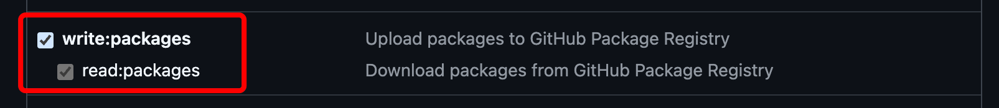

# @qws-org/ui-kit

### [Список доступных компонентов тут (Storybook)](https://qws-org.github.io/ui-kit/?path=/docs/ui-kit-components-accordion--docs)

## Технологический стек:

- ["tailwindcss": "3.4.15"](https://v3.tailwindcss.com/)
- react >=18
- [react-aria](https://react-spectrum.adobe.com/react-aria/index.html)
---

##  Настройка проекта:


- установить пакет
```shell
npm install @qws-org/ui-kit
```

---
## Подключение в проект:


- в корне проекта подключаем компоненты из ui-kit


- Используем компоненты из библиотеки

---

## Contributing

- копируем .npmrc
```shell
cp .npmrc.example .npmrc
```

- создаем приватный github токен https://github.com/settings/tokens
- выдаем права на чтение/запись из репозитория 

- вставляем токен в .npmrc
- Устанавливаем заисимости
```shell
pnpm install
```
- Запускаем сторибук (dev разработка)
```shell
pnpm run storybook
```

- Создаем мр в main ветку, дожидаемся завершения пайплайна и апрува от коллег
- Мерджим изменения в main
- Создаем github Release (указываем тег формата x1.x2.x3)
  - x1 - major version
  - x2 - minor version
  - x4 - patch version
- Ожидаем окончание пайплайна и публикации новой версии
